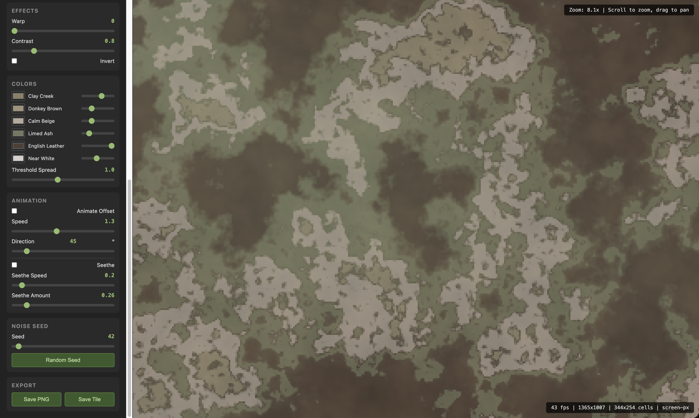

# CAMO - Procedural Camouflage & Texture Generator

Real-time procedural camouflage and texture generator with two implementations:

1. **Web App** (`index.html`) - Browser-based real-time generator with interactive controls
2. **DaVinci Resolve Fusion Fuse** (`MARPATCamo.fuse`) - Native Fusion plugin for video production

Both generate MARPAT-style digital camouflage, MultiCam-style organic patterns, and a wide range of artistic texture presets using fractal Brownian motion (fBm) over simplex noise.



https://github.com/ecsplendid/CAMO/raw/main/demo.mp4

*Demo: Web app (first half) followed by DaVinci Resolve Fusion integration (second half)*

---

## Web App

### Quick Start

Open `index.html` in any modern browser. No dependencies, no build step.

### Features

- **Real-time rendering** at 60-120fps using Canvas 2D with Uint32Array pixel writes
- **20+ presets** spanning military camouflage, cinematic textures, and artistic palettes
- **Two rendering modes**:
  - **Digital (MARPAT)** - Pixelated rectangular cells with hard color thresholds
  - **Organic (MultiCam)** - 3-layer architecture with smooth gradient blending, organic blobs, and micro-texture
- **Zoom & pan** - Scroll to zoom (toward cursor), drag to pan. Wobble-free integer screen-space grid mapping
- **Animation** - Directional scrolling with speed/direction controls
- **Seethe** - Cyclical in-place pattern evolution via domain warping (no translation). Threshold shifting creates organic "breathing" motion
- **Screen Pixels mode** - Pixel size stays constant on screen regardless of zoom
- **Effects** - Static domain warp, contrast adjustment, color inversion
- **Per-color controls** - Individual color pickers and weight sliders for each palette color
- **Export** - Save current view as PNG or generate a 512x512 tile

### Controls

| Section | Control | Description |
|---------|---------|-------------|
| **Preset** | Buttons | 20+ presets: Woodland, Desert, Snow, Urban, Tiger Stripe, Flecktarn, CADPAT, Night, MultiCam, MC Arid, MC Tropic, Cyberpunk, Autumn, Ocean, Lava, Pastel, Film Grain, Noir, Smoke, Parchment, Moss, Concrete, Dusk, MLST |
| **Pattern** | Pixel Size | Size of each pattern cell (1-16) |
| | Scale | Noise frequency - lower = larger features |
| | Detail (Octaves) | Noise detail levels (1-8) |
| | Lacunarity | Frequency multiplier between octaves |
| | Persistence | Amplitude decay between octaves |
| | Pixel Aspect | Width/height ratio of pattern cells |
| | Screen Pixels | When checked, pixel size is constant on screen regardless of zoom |
| **Effects** | Warp | Static fbm domain warping intensity (0-5) |
| | Contrast | Noise contrast before color mapping (0.5-2.0) |
| | Invert | Flip the noise value |
| **Colors** | Color pickers | Per-color hex value and weight |
| | Threshold Spread | Spread of color band boundaries |
| **Animation** | Animate Offset | Enable directional scrolling |
| | Speed | Scroll speed |
| | Direction | Scroll angle (0-359 degrees) |
| | Seethe | Enable cyclical in-place pattern evolution |
| | Seethe Speed | Evolution rate |
| | Seethe Amount | Evolution intensity |
| **Noise Seed** | Seed | Noise permutation seed (0-999) |

### Performance Optimizations

- **Zoom-adaptive coarsening** - Grid cells merge when sub-pixel, maintaining consistent performance at any zoom level
- **Coarse gradient grid** - MultiCam background gradient computed at 1/8 resolution with bilinear interpolation
- **Reduced octaves at zoom-out** - Detail noise octaves decrease when zoomed out (invisible detail is not computed)
- **Uint32Array pixel writes** - 4x fewer array operations vs byte-by-byte writes
- **Integer screen-space mapping** - Eliminates floating-point wobble artifacts during animation
- **Grid-cell noise caching** - Noise computed once per grid cell, not per screen pixel

---

## DaVinci Resolve Fusion Fuse

### Installation

1. **Copy the fuse file** to the Fusion Fuses directory:

   **macOS:**
   ```bash
   cp MARPATCamo.fuse ~/Library/Application\ Support/Blackmagic\ Design/DaVinci\ Resolve/Fusion/Fuses/
   ```

   **Windows:**
   ```
   Copy MARPATCamo.fuse to:
   %AppData%\Blackmagic Design\DaVinci Resolve\Support\Fusion\Fuses\
   ```

   **Linux:**
   ```bash
   cp MARPATCamo.fuse ~/.fusion/BlackmagicDesign/DaVinci\ Resolve/Fusion/Fuses/
   ```

2. **Restart DaVinci Resolve**

3. In the **Fusion page**, right-click the node editor and select **Add Tool > Generator > MARPAT Camo**

### Performance Note

The Fusion Fuse uses Lua-based CPU rendering (per-pixel `SetPixel` loops). Performance is highly dependent on **Pixel Size**:

- **Pixel Size 8+**: Smooth interactive preview at 1080p
- **Pixel Size 4-6**: Usable for preview, slight lag
- **Pixel Size 1-3**: Slow for interactive work, best reserved for final render
- **Organic (MultiCam) mode**: More computationally intensive than Digital mode due to 3-layer blending and additional noise evaluations

For interactive editing, work at a higher pixel size and reduce it for the final render. Frame caching means static frames render only once.

The web app achieves significantly better performance because it uses optimized JavaScript with Uint32Array writes and runs in the browser's highly optimized Canvas pipeline.

### Fuse Features

- **21 presets**: Woodland, Desert, Snow, Urban, Night, Noir, Smoke, Parchment, Moss, Concrete, Dusk, Cyberpunk, Autumn, Ocean, Lava, Pastel, Film Grain, MultiCam, MC Arid, MC Tropic, MLST, Custom
- **Two rendering modes**: Digital (MARPAT) and Organic (MultiCam)
- **6 color pickers with weights** - All presets prefill the pickers; customize any color after selecting a preset
- **All parameters keyframeable** - Animate any parameter over time in the Fusion spline editor
- **Seethe animation** - Keyframe the Seethe control linearly for continuous in-place pattern evolution. The value acts as a rate: constant value = continuous evolution, 0 = frozen
- **X/Y/Z Offsets** - Translate the pattern (keyframe for scrolling animation). Z offset morphs through 3D noise space
- **Zoom** - Scale the pattern view
- **Warp** - Static fbm domain warping for organic flowing shapes
- **Contrast** - Sharpen or soften color transitions
- **Invert** - Flip the noise mapping
- **Frame caching** - Automatically skips re-rendering when no parameters have changed between frames
- **Grid-cell caching** - Noise computed per grid cell, not per pixel (significant speedup)
- **Coarse gradient grid** - Organic mode computes background at 1/16 resolution with bilinear interpolation

### Fuse Parameters

| Parameter | Type | Default | Description |
|-----------|------|---------|-------------|
| Preset | Dropdown | Woodland | Select from 21 built-in presets or Custom |
| Mode | Dropdown | Digital | Digital (MARPAT) or Organic (MultiCam) |
| Pixel Size | Slider (1-32) | 4 | Pattern cell size in pixels |
| Scale | Slider (0.1-50) | 5.0 | Noise frequency |
| Octaves | Slider (1-8) | 4 | Noise detail levels |
| Lacunarity | Slider (1-4) | 2.0 | Frequency multiplier |
| Persistence | Slider (0-1) | 0.5 | Amplitude decay |
| Pattern Aspect | Slider (0.5-3) | 1.5 | Cell width/height ratio |
| Seed | Slider (0-999) | 42 | Noise seed |
| X Offset | Screw | 0 | Horizontal translation (keyframeable) |
| Y Offset | Screw | 0 | Vertical translation (keyframeable) |
| Z Offset | Screw | 0 | 3D noise depth (keyframeable) |
| Zoom | Slider (0.01-10) | 1.0 | Pattern scale |
| Seethe | Screw | 0 | Animation rate - keyframe linearly for evolution |
| Seethe Amount | Slider (0-5) | 1.0 | Seethe intensity |
| Warp | Slider (0-5) | 0 | Static domain warping |
| Contrast | Slider (0.5-2) | 1.0 | Color band sharpness |
| Invert | Checkbox | Off | Flip noise values |
| Colors 1-6 | Color pickers | Preset-dependent | RGBA color values |
| Weights 1-6 | Sliders (0-1) | Preset-dependent | Color band proportions |

### Usage Tips

- **Animating the pattern**: Keyframe X/Y Offset for scrolling, or keyframe Seethe for in-place evolution
- **Best performance**: Use Pixel Size 4+ for interactive preview; reduce for final render
- **Color matching**: Colors are written in the project's working color space. If colors look different in Edit vs Fusion, ensure your project's Color Space settings are consistent
- **Organic mode**: More computationally intensive due to 3-layer blending. Use larger pixel sizes for interactive work
- **Custom colors**: Select any preset to load its palette into the color pickers, then modify individual colors

---

## Technical Details

### Pattern Generation Algorithm

Both implementations use the same core algorithm:

1. **Simplex noise** with seeded permutation tables for deterministic output
2. **Fractal Brownian motion (fBm)** - Multiple octaves of noise summed with decreasing amplitude and increasing frequency
3. **Dual noise layers** - Primary noise for large-scale structure, secondary noise at 2.7x frequency for additional detail
4. **Color quantization** - Noise values mapped to discrete color bands via weighted cumulative thresholds

### MultiCam 3-Layer Architecture

Based on research into Crye Precision's MultiCam design and the Dutch NFP fractal method:

1. **Background gradient** (Layer 1) - Very low-frequency noise (0.15x scale) creates smooth regional color transitions. Two adjacent palette colors are interpolated based on noise value, creating the "color-shifting" effect that makes MultiCam appear to change hue regionally
2. **Mid-frequency organic blobs** (Layer 2) - Standard fBm noise provides macro-scale disruption shapes. Composited onto the gradient with variable opacity: hard edges deep inside color bands, fading edges near thresholds
3. **High-frequency micro-texture** (Layer 3) - Fine-grain detail from the secondary noise layer. Adds subtle per-channel RGB variation for close-range disruption

### Seethe Implementation

Unlike simple translation, seethe creates **cyclical in-place evolution**:

- **Domain warping**: `sin(position + phase)` and `cos(position + phase * 0.7)` distort noise coordinates in a position-dependent way. Each cell gets a unique warp, so the pattern morphs organically without sliding
- **Threshold shifting**: Sinusoidal modulation of color band boundaries causes colors to ebb and flow cyclically
- **No scale modulation**: Pattern scale remains constant (no zoom/breathing)

### Color Presets

| Category | Presets |
|----------|---------|
| **Military** | Woodland, Desert, Snow, Urban, Night, Tiger Stripe, Flecktarn, CADPAT |
| **MultiCam** | MultiCam (standard), MC Arid, MC Tropic |
| **Cinematic** | Noir, Smoke, Dusk, Film Grain, Parchment |
| **Natural** | Moss, Concrete, Autumn, Ocean |
| **Artistic** | Cyberpunk, Lava, Pastel |
| **Brand** | MLST (Machine Learning Street Talk - navy/gold) |

---

## License

MIT License. See [LICENSE](LICENSE) for details.

## Credits

Built with procedural noise generation techniques. MultiCam-style rendering inspired by published research on the Dutch NFP fractal method and Project Chameleon algorithm.
